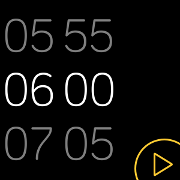

# Whitelist Alarm
## これは何
普通のアラームは起きる時間を設定してその時間になるとアラームを鳴らしますが、このアラームは寝る時間を設定して設定していない時間に睡眠を検知するとアラームを鳴らします。  
これによって布団の中でだらだらして気づいたら寝ていたといったことを防ぐことができます。

## 使い方
1. 寝落ちする可能性がある場所、例えば家では常にアプリを起動しておきます  
  
2. 寝るときは`Set/Reset`を押して何時まで寝るかを設定しましょう。設定を解除する場合は再度`Set/Reset`を押すことで解除できます  
  
3. アラームがなったときは`Stop`を押すことでアラームをストップできます
3. 外出時など明らかに寝落ちする可能性がない場所・充電中などはアプリを終了しましょう。一度ボタンを押して終了確認画面を出した状態で3回ボタンを押すと終了することができます  
  

## 対応デバイス
fitbit versa2でしか動作・レイアウト等の確認をしていません。

## 制限
fitbitのAPIの都合上バックグラウンドでは動作しないためアプリを常に起動しておく必要があります。  
誤ってボタンを押して終了しないように終了するには一度ボタンを押した後3回続けてボタンを押さないといけないようになっています。

## 注意
まだ実験段階で、アプリのクラッシュなどで突然終了したり、睡眠検知が上手くいかなかったりするので普段のアラームと併用し補助的に使うことをおすすめします。

